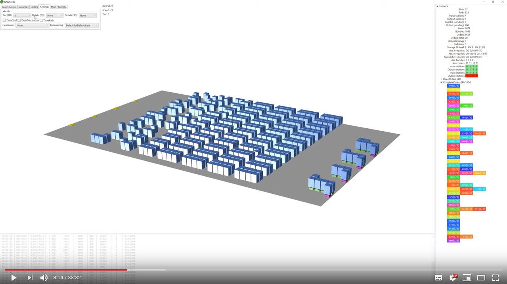
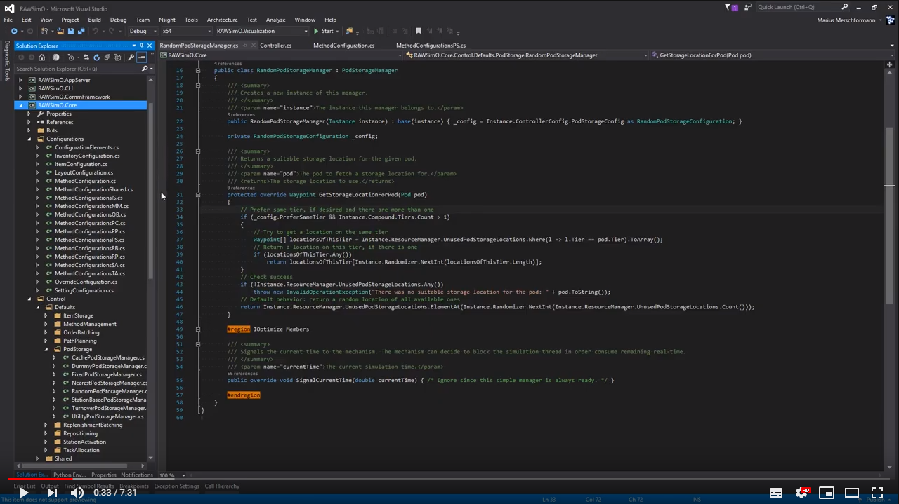
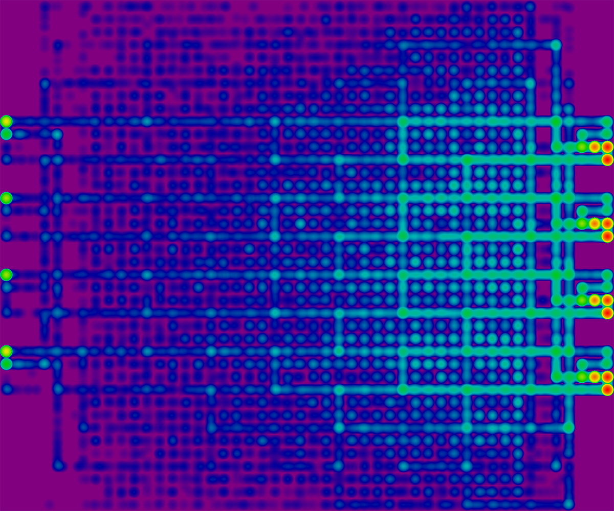

# RAWSim-O

RAWSim-O is a discrete event-based simulation for Robotic Mobile Fulfillment Systems. The intention of the simulation framework is to provide a tool for researching effects of multiple decision problems that occur when running such a system. For this, the framework enables easy extensibility for implementing new decision methods for the different decision problems.
Copyright (C) 2017 Marius Merschformann

## Quick start

Open RAWSimO.sln with Visual Studio and select RAWSimO.Visualization as the project to execute. Under the "Instances" tab press the checkmark button to generate a default instance. Then go to the "Base Controls" tab and press the play button. Depending on the instance size and simulation settings instance generation and simulation initialization may take longer. You should see a first simulation running now.

In the following video you can find a short tutorial of RAWSim-O's core functionality for a quick start:

## Controller implementation quick start

In the following video you can find a very short tutorial for implementing your own controller logic:

## Screenshots

Image showing a larger instance being simulated:

Image showing a multi-level instance being simulated:

Image showing more detailed information for path planning engines:

Image showing a heatmap rendered using RAWSim-O that shows the locations robots were at over time:

## Demonstrator video

A short video of the demonstrator application done with RAWSim-O and vacuum cleaning robots can be found here: 

## GnuPlot

Some of the functionality of RAWSim-O requires an installation of GnuPlot (see http://www.gnuplot.info/). GnuPlot's bin path must be added to the environment path variable.

# License

This program is free software: you can redistribute it and/or modify
it under the terms of the GNU General Public License as published by
the Free Software Foundation, either version 3 of the License, or
(at your option) any later version.

This program is distributed in the hope that it will be useful,
but WITHOUT ANY WARRANTY; without even the implied warranty of
MERCHANTABILITY or FITNESS FOR A PARTICULAR PURPOSE.  See the
GNU General Public License for more details.

You should have received a copy of the GNU General Public License
along with this program.  If not, see <http://www.gnu.org/licenses/>.

# Publications

RAWSim-O has been published here:
- Marius Merschformann, Lin Xie, Hanyi Li: RAWSim-O: A Simulation Framework for Robotic Mobile Fulfillment Systems, Logistics Research (2018), Volume 11, Issue 1, doi:10.23773/2018_8, [link](https://www.bvl.de/lore/all-volumes--issues/volume-11/issue-1/rawsim-o-a-simulation-framework-for-robotic-mobile-fulfillment-systems)

Further reading on some projects using RAWSim-O can be found here (let me know, if yours is missing):
- Marius Merschformann, Lin Xie, Daniel Erdmann: Multi-Agent Path Finding with Kinematic Constraints for Robotic Mobile Fulfillment Systems, working paper preprint available at [link](https://arxiv.org/abs/1706.09347)
- Marius Merschformann, Tim Lamballais, René de Koster, Leena Suhl: Decision Rules for Robotic Mobile Fulfillment Systems, Operations Research Perspectives, Volume 6 (2019), doi:10.1016/j.orp.2019.100128, available at [link](https://doi.org/10.1016/j.orp.2019.100128)
- Marius Merschformann: Active repositioning of storage units in Robotic Mobile Fulfillment Systems, Selected Papers of the Annual International Conference of the German Operations Research Society (GOR), Freie Universität Berlin, Germany, September 6-8, 2017, doi:10.1007/978-3-319-89920-6_51, [link](https://link.springer.com/chapter/10.1007/978-3-319-89920-6_51)

# Credits

This work was created as a part of the RMFS project initiated by Prof. Lin Xie. More information about the project can be found here https://www.researchgate.net/project/automated-robotic-mobile-fulfillment-systems-RMFS and here https://www.leuphana.de/institute/iis/personen/lin-xie.html

The work was supported by the Ecopti GmbH (Beijing Hanning ZN Tech) and a scholarship of the International Graduate School - Dynamic Intelligent Systems of the University of Paderborn (https://pace.uni-paderborn.de/pace-phd-programs/igs/)

## Contributers of the project

Marius Merschformann, Lin Xie, Hanyi Li, Tim Lamballais Tessensohn, Daniel Erdmann, Lena Knickmeier, Jonas König, Maik Herbort, Marcel Grawe

# Alphabet Soup

Special thanks go to the authors of the Alphabet Soup framework that was used as a basis for implementation of RAWSim-O:

Hazard, Christopher J., Peter R. Wurman, and Raffaello D’Andrea. "Alphabet soup: A testbed for studying resource allocation in multi-vehicle systems." Proceedings of the 2006 AAAI Workshop on Auction Mechanisms for Robot Coordination. 2006.

# Used software:
Thanks go out to the developers of the following software for enabling a more easy implementation of RAWSim-O.
## Helix Toolkit: ##
https://github.com/helix-toolkit/helix-toolkit
## WriteableBitmapEx ##
https://writeablebitmapex.codeplex.com/
## Emgu CV ##
http://www.emgu.com/
## Open CV ##
http://opencv.org/
## HidLibrary ##
https://github.com/mikeobrien/HidLibrary
## directshow.net library ##
http://directshownet.sourceforge.net/
## Blink(1) library ##
https://github.com/todbot/blink1
## ZXing.Net ##
https://zxingnet.codeplex.com/
